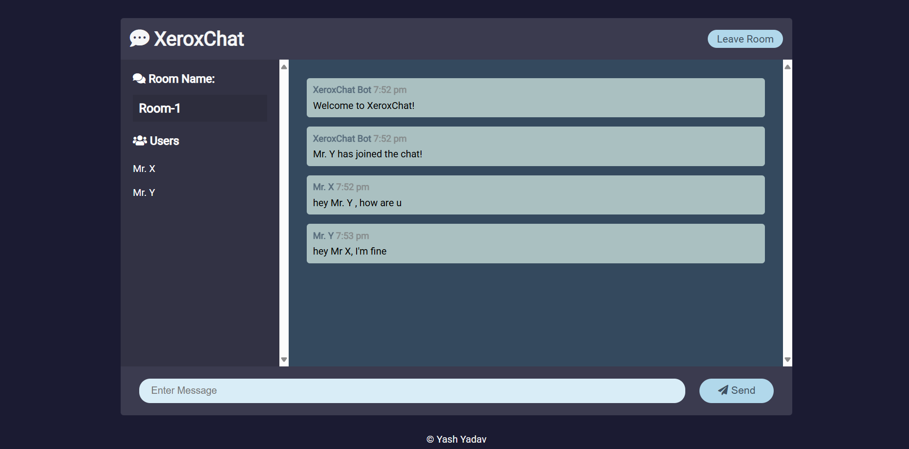

# TalkTown - Real-Time Chat Application

## 🚀 Introduction
TalkTown is a real-time chat application designed for seamless and instant communication. It provides a modern chat experience with features like private and group messaging, real-time updates, and responsive UI.

## 🔥 Features
- 🔹 **Real-time messaging** using WebSockets
- 🔹 **Private chats**
- 🔹 **Message history storage**
- 🔹 **Typing indicators**
- 🔹 **Modern UI with responsiveness**
- 🔹 **Emoji and media sharing** (optional)

---

## 📸 Demo Screenshots  
Here are some previews of TalkTown in action:  

### 🔹 Home Page  
  

### 🔹 Chat Interface  
    

----

## 📌 Usage
- Start a new chat with a friend or create a group.
- Enjoy real-time messaging with a smooth experience.

## 🤝 Contributing
Contributions are welcome! Feel free to fork this repository and submit a pull request.

